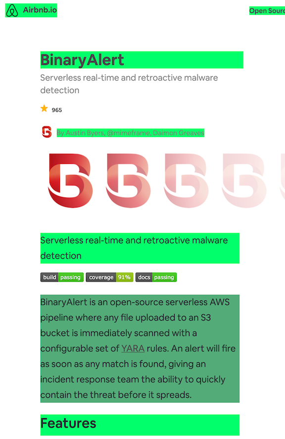

# Page Read Tracker

Approximates how much of a page's text has been read based on the amount of text and time on screen. Useful to understand how a user interacts with a page and where users spend most of their time.

⚠️ This is currently only a proof-of-concept and should not be used in production. The API and core functionality will change.

## Roadmap

* functionality
    * highlight support
    * rank according to screen position
    * identify reader behaviour (skimming vs reading)
* usability
    * server to collect and aggregate results
    * web interface to view read performance
    * live browser screenshots
* improved estimation
    * machine learning model
    * base reading rate on language
* misc
    * performance improvements

## Visual Demo
The brighter the green background, the most likely the text has been read.



## Building the Project

To install dependencies, run `npm install`. Build by running `npm run build`. Output will be in `dist/bundle.js`.

## Quickly Running in Browser
Run this then paste into the console. (MacOS)
```
npm run build && cat dist/bundle.js | pbcopy
```

## API

`poll()`: `void`
Triggers `this.snapshot()` on a polling period.

`snapshot()`: `void`
Updates the internal list of DOM elements and associated scores.

## Definitions

`ElementMetric` class
    * `score` - A number from 0 - 1 representing the likelyhood that a DOM element's text has been read
